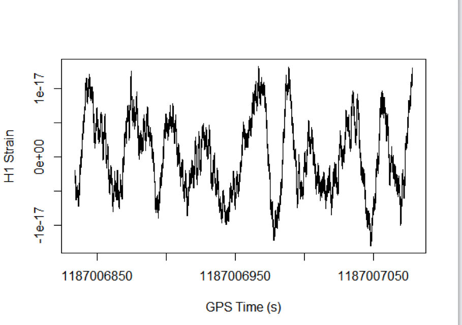

1.	Завантажте файл з даними за посиланням https://dcc.ligo.org/public/0146/P1700337/001/H-H1_LOSC_C00_4_V1-1187006834-4096.hdf5 

	```r
	download.file('https://dcc.ligo.org/public/0146/P1700337/001/H-H1_LOSC_C00_4_V1-1187006834-4096.hdf5', 'data.hdf5', mode='wb')
	```
2.	Встановить в R пакет для роботи з HDF5 файлами.

	```r
	> source("http://bioconductor.org/biocLite.R")
	> biocLite("rhdf5")
	> library(rhdf5)
	```
3.	Виведіть зміст файлу командою h5ls().

	```r
	> h5ls('data.hdf5')
	                 group            name       otype  dclass      dim
	0                    /            meta   H5I_GROUP                 
	1                /meta     Description H5I_DATASET  STRING    ( 0 )
	2                /meta  DescriptionURL H5I_DATASET  STRING    ( 0 )
	3                /meta        Detector H5I_DATASET  STRING    ( 0 )
	4                /meta        Duration H5I_DATASET INTEGER    ( 0 )
	5                /meta        GPSstart H5I_DATASET INTEGER    ( 0 )
	6                /meta     Observatory H5I_DATASET  STRING    ( 0 )
	7                /meta            Type H5I_DATASET  STRING    ( 0 )
	8                /meta        UTCstart H5I_DATASET  STRING    ( 0 )
	9                    /         quality   H5I_GROUP                 
	10            /quality          detail   H5I_GROUP                 
	11            /quality      injections   H5I_GROUP                 
	12 /quality/injections InjDescriptions H5I_DATASET  STRING        5
	13 /quality/injections   InjShortnames H5I_DATASET  STRING        5
	14 /quality/injections         Injmask H5I_DATASET INTEGER     4096
	15            /quality          simple   H5I_GROUP                 
	16     /quality/simple  DQDescriptions H5I_DATASET  STRING        7
	17     /quality/simple    DQShortnames H5I_DATASET  STRING        7
	18     /quality/simple          DQmask H5I_DATASET INTEGER     4096
	19                   /          strain   H5I_GROUP                 
	20             /strain          Strain H5I_DATASET   FLOAT 16777216
	
	```
4.	Зчитайте результати вимірів. Для цього зчитайте name Strain з групи strain в змінну strain. Після зчитування не забувайте закривати файл командою H5Close().

	```r
	> strain <- h5read("data.hdf5", "strain/Strain")
	> H5close()
	> head(strain)
	[1] -2.391646e-18 -2.411660e-18 -2.427382e-18 -2.426351e-18 -2.427996e-18 -2.446291e-18
	```
5.	Також з «strain/Strain» зчитайте атрибут (функція h5readAttributes) Xspacing в змінну st та виведіть її. Це інтервал часу між вимірами.

	```r
	> st <- h5readAttributes("data.hdf5", "/strain/Strain")$Xspacing
	> st
	[1] 0.0002441406
	```
6.	Знайдіть час початку події та її тривалість. Для цього з групи meta зчитайте в змінну gpsStart  name GPSstart та в змінну duration name Duration.

	```r
	> gpsStart <- h5read("data.hdf5", "meta/GPSstart")
	> duration <- h5read("data.hdf5", "meta/Duration")
	> gpsStart
	[1] 1187006834
	> duration
	[1] 4096
	```
7.	Знайдіть час закінчення події та збережіть його в змінну gpsEnd.

	```r
	> gpsEnd <- gpsStart + duration
	> gpsEnd
	[1] 1187010930
	```
8.	Створіть вектор з часу вимірів і збережіть у змінну myTime. Початок послідовності – gpsStart, кінець – gpsEnd, крок – st.

	```r
	> myTime <- seq(gpsStart, gpsEnd, st)
	```	
9.	Побудуємо графік тільки для першого мільйону вимірів. Для цього створіть змінну numSamples, яка дорівнює 1000000.

	```r
	numSamples <- 1000000
	```
10.	Побудуйте графік за допомогою функції plot(myTime[0:numSamples], strain[0:numSamples], type = "l", xlab = "GPS Time (s)", ylab = "H1 Strain")

	```r
	plot(myTime[0:numSamples], strain[0:numSamples], type = "l", xlab = "GPS Time (s)", ylab = "H1 Strain")
	```

